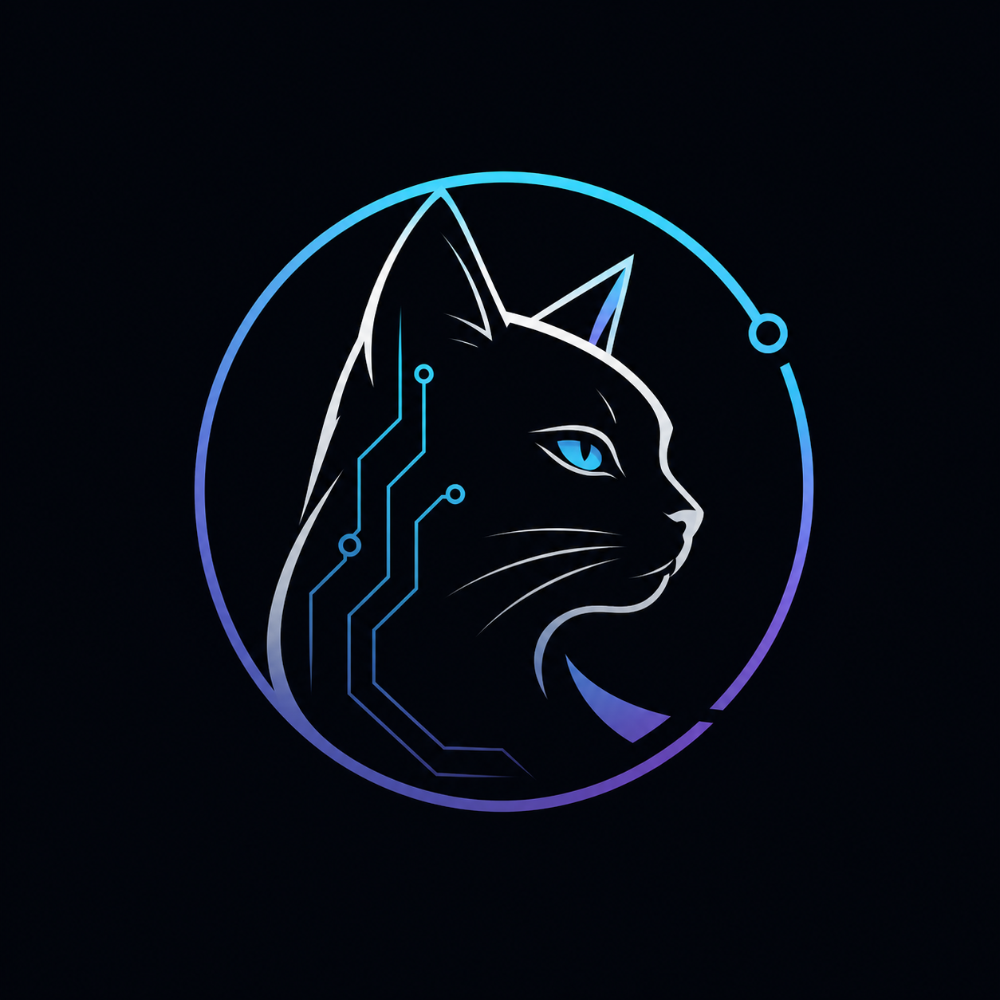

<!--
  tamir39 · circuit-familiar profile
  ────────────────────────────────────────────────────────────
  fill in these tokens with your real values, then commit:
    <NOW_PLAYING>      one line · what you're shipping
    <NOW_LEARNING>     one line · what you're studying
    <LINKEDIN_HANDLE>  e.g. tam-phi
    <X_HANDLE>         e.g. tamir39           (or remove the link)
    <ITCHIO_HANDLE>    e.g. tamir39           (or remove the link)
    <TELEGRAM_HANDLE>  e.g. tamir39           (or remove the link)
    <DISCORD_INVITE>   discord username/invite (or remove the link)
-->

  <video src="https://github.com/tamir39/tamir39/raw/main/tamir.mp4" width="240" autoplay loop muted playsinline poster="./tamir-avatar.png">
    
  </video>

  

 

  building shippable products at the boundary of web and games.

 

  <code>web</code>&nbsp;·&nbsp;typescript&nbsp;·&nbsp;react&nbsp;·&nbsp;next&nbsp;·&nbsp;tailwind
  &nbsp;&nbsp;⋮&nbsp;&nbsp;
  <code>game</code>&nbsp;·&nbsp;godot&nbsp;·&nbsp;c#
  &nbsp;&nbsp;⋮&nbsp;&nbsp;
  <code>tools</code>&nbsp;·&nbsp;vscode&nbsp;·&nbsp;figma&nbsp;·&nbsp;git

 

  <strong>now</strong>&nbsp;&nbsp;<NOW_PLAYING> 
  <strong>learning</strong>&nbsp;&nbsp;<NOW_LEARNING>

 
 

  
  

 

<picture>
  <source media="(prefers-color-scheme: dark)" srcset="https://raw.githubusercontent.com/tamir39/tamir39/output/github-contribution-grid-snake-dark.svg"/>
  <source media="(prefers-color-scheme: light)" srcset="https://raw.githubusercontent.com/tamir39/tamir39/output/github-contribution-grid-snake.svg"/>
  
</picture>

 
 

  
  

  
  

 
 

  &nbsp;
  <a href="https://www.linkedin.com/in/<LINKEDIN_HANDLE>/"></a>&nbsp;
  <a href="https://x.com/<X_HANDLE>"></a>&nbsp;
  <a href="https://<ITCHIO_HANDLE>.itch.io/"></a>&nbsp;
  <a href="https://t.me/<TELEGRAM_HANDLE>"></a>&nbsp;
  <a href="https://discord.com/users/<DISCORD_INVITE>"></a>

