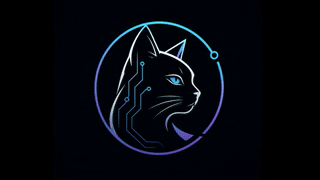

<!--
  tamir39 · circuit-familiar profile
  ────────────────────────────────────────────────────────────
  fill in these tokens with your real values, then commit:
    <NOW_PLAYING>      one line · what you're shipping
    <NOW_LEARNING>     one line · what you're studying
    <LINKEDIN_HANDLE>  e.g. tam-phi
    <X_HANDLE>         e.g. tamir39           (or remove the link)
    <ITCHIO_HANDLE>    e.g. tamir39           (or remove the link)
    <TELEGRAM_HANDLE>  e.g. tamir39           (or remove the link)
    <DISCORD_INVITE>   discord username/invite (or remove the link)
-->

  <picture>
    <source srcset="./assets/tamir.webp" type="image/webp"/>
    
  </picture>

  

  

  
  
  

 

  building shippable products at the boundary of web and games.

  <strong>now</strong>&nbsp;&nbsp;<NOW_PLAYING>&nbsp;&nbsp;&nbsp;⌁&nbsp;&nbsp;&nbsp;<strong>learning</strong>&nbsp;&nbsp;<NOW_LEARNING>

 

## ⌁ stack

  

  

 

## ⌁ telemetry

  
  

  
  

  

 

## ⌁ trophies

  

 

## ⌁ activity

<picture>
  <source media="(prefers-color-scheme: dark)" srcset="https://raw.githubusercontent.com/tamir39/tamir39/output/github-contribution-grid-snake-dark.svg"/>
  <source media="(prefers-color-scheme: light)" srcset="https://raw.githubusercontent.com/tamir39/tamir39/output/github-contribution-grid-snake.svg"/>
  
</picture>

 

## ⌁ pinned

<table>
  <tr>
    <td width="50%" valign="top">
      <a href="https://github.com/tamir39/project-os">
        <h3>◈ project-os</h3>
      </a>
      ProjectOS is a local-only, read-only personal project dashboard.  
      
      
      
    </td>
    <td width="50%" valign="top">
      <a href="https://github.com/tamir39/escape-the-belt-2d-game">
        <h3>◈ escape-the-belt-2d-game</h3>
      </a>
      Navigate a lethal asteroid field. Fuel your engines, dodge the chaos, reach 500 points to Escape the Belt.  
      
      
      
    </td>
  </tr>
  <tr>
    <td width="50%" valign="top">
      <a href="https://github.com/tamir39/my-portfolio">
        <h3>◈ my-portfolio</h3>
      </a>
      Personal portfolio site — typescript / web frontend playground.  
      
      
      
    </td>
    <td width="50%" valign="top">
      <a href="https://github.com/tamir39/vqa-viet-project">
        <h3>◈ vqa-viet-project</h3>
      </a>
      Deep Learning final project — visual question answering on Vietnamese data.  
      
      
      
    </td>
  </tr>
</table>

 

## ⌁ connect

  
  <a href="https://www.linkedin.com/in/<LINKEDIN_HANDLE>/"></a>
  <a href="https://x.com/<X_HANDLE>"></a>
  <a href="https://<ITCHIO_HANDLE>.itch.io/"></a>
  <a href="https://t.me/<TELEGRAM_HANDLE>"></a>
  <a href="https://discord.com/users/<DISCORD_INVITE>"></a>

 

  <code>// END_OF_TRANSMISSION</code>

