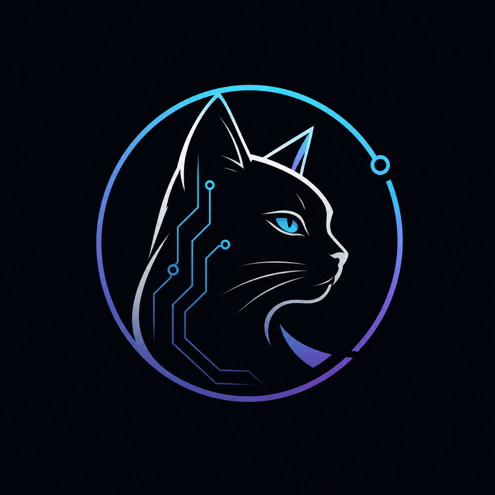

  

<h1 align="center">Tamir</h1>

Phí Vương Tường Tâm

<strong>Frontend developer with an eye for design and a focus on how things work.</strong>

UI/UX · Visual refinement · User flows

  <a href="https://tamir39-portfolio.vercel.app/">Portfolio</a>
  &nbsp; · &nbsp;
  <a href="https://www.linkedin.com/in/tam-phi-vuong-tuong-686919388/">LinkedIn</a>
  &nbsp; · &nbsp;
  <a href="https://zuno-lyart.vercel.app/">Zuno</a>

---

## About me

I'm Tamir, a freelance frontend developer and computer science student at Ton Duc Thang University. My work centers on UI/UX: refining the visual details of an interface and making its interactions and user flows easier to follow.

I'm drawn to the connection between design and implementation—how a layout, a small interaction, and the logic behind it come together to shape the experience.

Currently, I'm deepening my UI/UX skills and learning full stack development so I can build more of a product myself.

## What I focus on

- **Visual refinement:** improving layout, spacing, typography, and consistency across interfaces.
- **User experience:** making navigation, interactions, and the steps in a task clearer.
- **Frontend integration:** connecting interface elements with application logic to make features work together.

## My toolkit

Across my dashboard, storefront, and personal application work, I use:

| Area | Tools |
| --- | --- |
| Frontend | React, TypeScript, Tailwind CSS |
| Frameworks & tooling | Next.js, Vite |
| Components & motion | shadcn/ui, Radix UI, Motion / Framer Motion |
| State & data | Zustand, TanStack Query |

I'm also building full stack experience through Zuno with PostgreSQL and Drizzle ORM.

## Experience

### Twohearts

**Frontend development & UI/UX design · June 2026–present**

My work includes frontend refinement and connecting interfaces with application logic, with a focus on visual quality and user flows.

### Freelance

**Currently open to freelance work**

My focus is frontend development, UI/UX improvements, and refining existing interfaces.

## Team achievement

**F&B Track winner · Agentic AI Build Week 2026**

Part of the Twohearts team that won the KFC Vietnam-sponsored F&B Track at Agentic AI Build Week, organized by GenAI Fund.

[View the organizer's announcement →](https://www.linkedin.com/posts/genai-fund_aabw2026-aabwxgaf-activity-7482359686189445120-FEhQ)

## My application

### [Zuno](https://zuno-lyart.vercel.app/)

Zuno is my personal application: a private social timeline built around shared spaces called **Zones**. Members can share text and images, react to posts, and vote within their space.

It's where I explore the connection between interface design and full stack development—from joining a Zone to sharing and interacting with its timeline.

**Built with:** Next.js · React · TypeScript · Tailwind CSS · Zustand · PostgreSQL

[Explore Zuno →](https://zuno-lyart.vercel.app/)

## Let's connect

For freelance work and collaboration, find me on [LinkedIn](https://www.linkedin.com/in/tam-phi-vuong-tuong-686919388/) or call **0938 419 071**.

More about my work: [tamir39-portfolio.vercel.app](https://tamir39-portfolio.vercel.app/).
