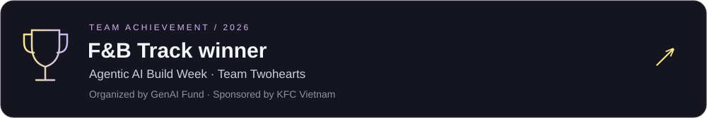
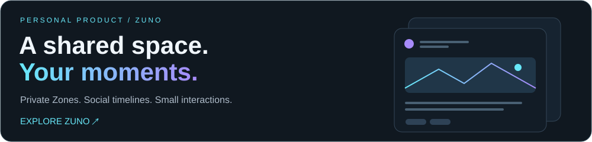

  

  <a href="https://tamir39-portfolio.vercel.app/"><strong>Explore my portfolio ↗</strong></a>
  &nbsp;&nbsp; / &nbsp;&nbsp;
  <a href="https://www.linkedin.com/in/tam-phi-vuong-tuong-686919388/">Connect on LinkedIn ↗</a>
  &nbsp;&nbsp; / &nbsp;&nbsp;
  <a href="https://zuno-lyart.vercel.app/">Try Zuno ↗</a>

 

## 01 / Behind the interface

I'm **Tamir — Phí Vương Tường Tâm**, a freelance frontend developer and computer science student at **Ton Duc Thang University**. I work where visual design meets application logic: refining the details people see and the flows they move through.

<table>
<tr>
<td width="33%" valign="top">
<h3>Visual craft</h3>
Layout, spacing, typography, and the small details that make an interface feel coherent.
</td>
<td width="33%" valign="top">
<h3>Thoughtful flows</h3>
Clear navigation and interactions that help people move through a task with confidence.
</td>
<td width="33%" valign="top">
<h3>Connected experiences</h3>
Frontend features that bring the interface and application logic together.
</td>
</tr>
</table>

**Currently exploring →** Deeper UI/UX practice and full stack development through my own product, Zuno.

 

## 02 / Work & recognition

### Twohearts · Frontend development & UI/UX design

**June 2026–present** · Dashboard and storefront work spanning visual refinement, user flows, and frontend integration.

Part of the winning Twohearts team. <a href="https://www.linkedin.com/posts/genai-fund_aabw2026-aabwxgaf-activity-7482359686189445120-FEhQ">Organizer's announcement ↗</a>

  

## 03 / Something of my own

**[Zuno](https://zuno-lyart.vercel.app/)** is my personal application: a private social timeline organized into shared spaces called **Zones**. Members share text and images, react to posts, and vote within their space.

It's where I explore the entire product flow—from joining a Zone to sharing and interacting with its timeline—and build experience beyond the frontend.

Next.js · React · TypeScript · Tailwind CSS · Zustand · PostgreSQL · Drizzle ORM

  

## 04 / Tools behind the work

  

**Core frontend** &nbsp; React · TypeScript · Tailwind CSS · Next.js · Vite 
**Components & motion** &nbsp; shadcn/ui · Radix UI · Motion / Framer Motion 
**State & data** &nbsp; Zustand · TanStack Query 
**Growing full stack experience** &nbsp; PostgreSQL · Drizzle ORM

 

---

<strong>Have an interface that could work—and feel—better?</strong>

Open to freelance frontend development and UI/UX work.

  <a href="https://www.linkedin.com/in/tam-phi-vuong-tuong-686919388/">Let's connect on LinkedIn ↗</a>
  &nbsp; · &nbsp; <strong>0938 419 071</strong>

Tamir / Design → Develop → Refine

