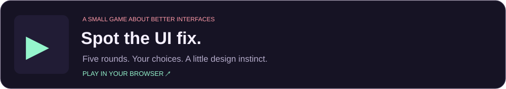

  

  <a href="#arcade">Play</a> &nbsp; · &nbsp;
  <a href="https://tamir39.com/"><strong>Explore my portfolio ↗</strong></a>
  &nbsp;&nbsp; / &nbsp;&nbsp;
  <a href="https://www.linkedin.com/in/tam-phi-vuong-tuong-686919388/">Connect on LinkedIn ↗</a>
  &nbsp;&nbsp; / &nbsp;&nbsp;
  <a href="https://zuno.page/">Try Zuno ↗</a>

  <a href="#about">About me</a> &nbsp; · &nbsp;
  <a href="#work">Work &amp; recognition</a> &nbsp; · &nbsp;
  <a href="#zuno">Zuno</a> &nbsp; · &nbsp;
  <a href="#toolkit">Toolkit</a> &nbsp; · &nbsp;
  <a href="#contact">Contact</a>

 

## Player 02 / Your turn

**[Play Interface Arcade ↗](https://tamir39.github.io/tamir39/)** — a small game I made for this profile. Choose the interface that fits the situation, find out why, and try for **5 / 5**. No timer.

<strong>Stay here? Play a quick choose-and-reveal round.</strong>

**The mission:** A new Zuno Zone is empty. What would you show first? Open your choice to reveal the outcome.

A / “No data. 0 records found.”

**Outcome: the next step is still a mystery.** The message describes the database state, but gives the person no reason or way to begin. Try another approach.

B / “Your Zone starts here.” + “Create your first post”

**Outcome: first-post path unlocked.** A little context and one relevant action turn an empty screen into an invitation. That's the kind of detail I enjoy building.

**Reward:** 🐾 The cat approves your design instinct.

C / Fill the screen with sample posts

**Outcome: a lively screen, with a possible trust problem.** Clearly labeled examples can teach; unlabeled content can make people wonder who posted it. Make the distinction visible and keep the real first action available.

Close your choice to reset this round, or [play all five rounds with scoring ↗](https://tamir39.github.io/tamir39/).

 

## The builder / Behind the pixels

I'm **Tamir — Phí Vương Tường Tâm**, a frontend developer and computer science student at **Ton Duc Thang University**. I work where visual design meets application logic: refining the details people see and the flows they move through.

<table>
<tr>
<td width="33%" valign="top">

<strong>Visual craft</strong>

Layout, spacing, typography, and the small details that make an interface feel coherent.

</td>
<td width="33%" valign="top">

<strong>Thoughtful flows</strong>

Clear navigation and interactions that help people move through a task with confidence.

</td>
<td width="33%" valign="top">

<strong>Connected experiences</strong>

Frontend features that bring the interface and application logic together.

</td>
</tr>
</table>

Expand a focus area to read more.

**Currently exploring →** Deeper UI/UX practice and full stack development through my own product, Zuno.

 

## Quest log / Work & recognition

### Twohearts · Frontend development & UI/UX design

**June 2026–present** · Dashboard and storefront work spanning visual refinement, user flows, and frontend integration.

Part of the winning Twohearts team. <a href="https://www.linkedin.com/posts/genai-fund_aabw2026-aabwxgaf-activity-7482359686189445120-FEhQ">Organizer's announcement ↗</a>

  

## Personal build / Zuno

**[Zuno](https://zuno.page/)** is my personal application: a private social timeline organized into shared spaces called **Zones**. Members share text and images, react to posts, and vote within their space.

It's where I explore the entire product flow—from joining a Zone to sharing and interacting with its timeline—and build experience beyond the frontend.

<strong>Explore the Zuno flow &amp; technology</strong>

1. Create or join a private Zone through an invite.
2. Share text and images in its timeline.
3. React to posts and participate in votes with other members.

Next.js · React · TypeScript · Tailwind CSS · Zustand · PostgreSQL · Drizzle ORM

[Try Zuno ↗](https://zuno.page/)

  

## Inventory / Tools behind the work

**React / TypeScript / Tailwind CSS / Next.js / Vite**

<strong>See my toolkit by area</strong>

**Core frontend** &nbsp; React · TypeScript · Tailwind CSS · Next.js · Vite 
**Components & motion** &nbsp; shadcn/ui · Radix UI · Motion / Framer Motion 
**State & data** &nbsp; Zustand · TanStack Query 
**Growing full stack experience** &nbsp; PostgreSQL · Drizzle ORM

 

---

<strong>What could we create in your next product?</strong>

Connect with me about frontend development, UI/UX, and thoughtful products.

  <a href="https://www.linkedin.com/in/tam-phi-vuong-tuong-686919388/">Let's connect on LinkedIn ↗</a>
  &nbsp; · &nbsp; <strong>0938 419 071</strong>

<a href="https://tamir39.com/#contact">Tell me what you have in mind ↗</a>

Tamir / Design + code + a little play.

<a href="#top">Back to top ↑</a>

